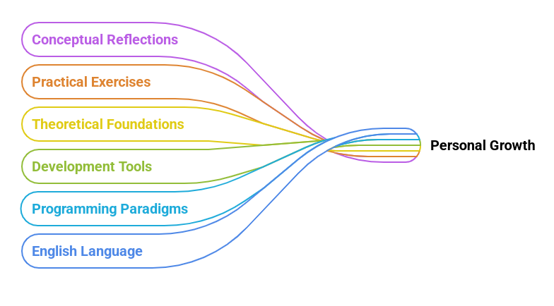

<h1>
TECH Notebook     
  
</h1>

This notebook serves as a structured and evolving record of my ongoing development in the field of technology and software engineering. It encompasses a range of topics, including programming paradigms, system architecture, development tools, and theoretical foundations. The entries reflect both practical exercises and conceptual reflections, forming a personal knowledge base to support deeper understanding and long-term growth in the discipline.

All annotations and reflections are composed in English as an intentional strategy to enhance my proficiency in the language. Given the global nature of the technology sector, developing technical fluency in English is essential for engaging with international resources, collaborating across borders, and contributing meaningfully to the wider developer community.

This notebook is, therefore, both a technical journal and a linguistic exercise — a space where my growth as a developer and as an English speaker.

