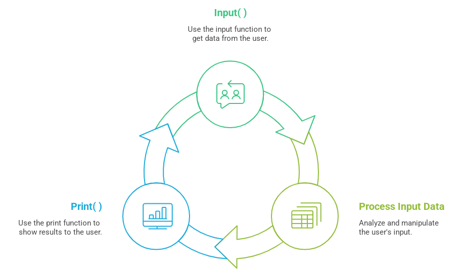

<h1>
input( ) & print( )



</h1>
<br>
With these functions, we can make a simple Python script much more dynamic and powerful, enabling interaction with the user.

We will see how to use the input function to acquire input data provided by the user, as well as how to display information to users using the print function.
<br>
<br>
<br>
## Data Input with the input( ) Function

This is a very common technique in programming when we need the user to provide some kind of data to the program.

In Python, we do this using the input( ) function.

The input( ) function takes a **string*** as a parameter, which will be displayed to assist the user, usually informing them what type of data the program is expecting to receive.

***string** - A string is a data type in programming that represents a sequence of characters—like letters, numbers, symbols.
You can think of a string as text. So anytime you see words or characters between quotes, that’s a string.

Example:

```python
input("Enter your name:")
```

the terminal or command prompt will:

* Display the text "Enter your name:" on the screen; 

* Wait until the user types in some information.

After the user enters the data, the program will continue its execution, moving on to the next instructions.

In the terminal, it will look something like this:

```python
>>> Enter your name: Gabriel
```
## Data output with the print( ) function

The function used to print data in Python is the print( ) function.
It is responsible for displaying values in your terminal:
```python
print("Hello world!")
```
Prints the string to the terminal:
```python
Hello world!
```
## The sep= parameter of the print( ) function

By default, when we use commas to separate items, the print function uses space to separate each output.
However, we can use the sep= parameter to define a custom separator character.

Take a look at the example below:
```python
print('Day', 'Month', 'Year', sep='/')
print('Yesterday', 'Today', 'Tomorrow', sep='-')
print("B", "n", "n", ".", sep='a')
```
Look the output with the defined characters:
```python
Day/Month/Year
Yesterday-Today-Tomorrow
Banana
```

the print function included the character specified in sep= as the separator for the data to be displayed to the user!

## The end= parameter of the print function

the print function uses a newline character (\n) as the last character.

The end= parameter is responsible for changing this behavior, allowing the developer to choose which character will be added at the end of the data printed to the terminal.

Let’s understand this better with the example below:
```python
# Example with no end character (no line break)
print('Let’s study at ', end='')
print('Python Academy')

# Example with end character set to ->
print('Roses are', end=' -> ')
print('Red')

# Example with end character set to :
print('Quantity', end=': ')
print(40)
```

Output:
```python
Let’s study at Python Academy
Roses are -> Red
Quantity: 40
```

## Using input and output with input and print
Now that we know both functions, we can use them together to create more complete programs.

We'll store the user's name using input and display the data back to them using print.

We can combine and print multiple items in print( ) by separating them with commas, as shown in the example below:

```python
name = input("Type your name: ")
print('Your name is:', name)
```

Notice that the input function returns whatever the user types.
Therefore, in this case, the user's input will be assigned to the variable name!

Observe the output:
```python
Type your name: Erick
Your name is: Erick
```
